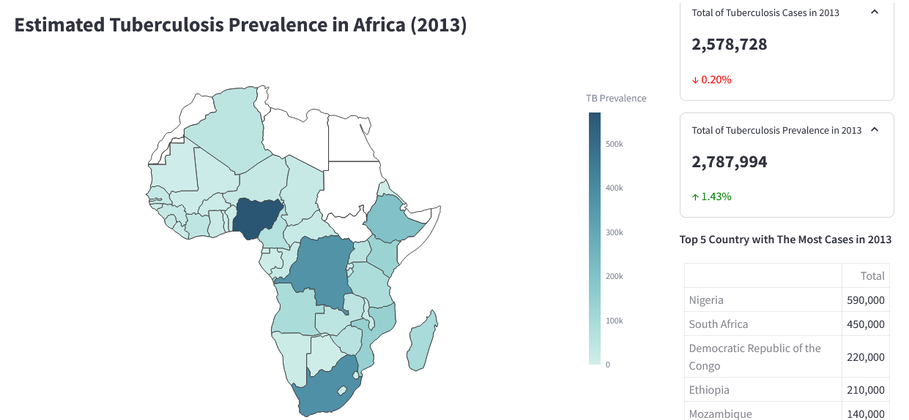

# Tuberculosis Data Dashboard in Africa (1990-2013)

This repository contains the source code for a tuberculosis data dashboard in Africa created using Streamlit.

## Description

This dashboard displays tuberculosis data in Africa from 1990 to 2013. Using Streamlit, the dashboard allows users to explore data dynamically and interactively to recieve information about the prevalence of tuberculosis in African countries.

## Features

- **Country and Year Filters**: Allows user to view the data dynamically according to year, year range, or country.
- **Total Population Map**: Displays the estimated total population in African countries.
- **Tuberculosis Prevalence Map**: Shows the estimated prevalence of tuberculosis in African countries.
- **Interactive Visualizations**: Interactive line chart, pie chart and bar chart displaying the difference of TB and TB-HIV data over the years.